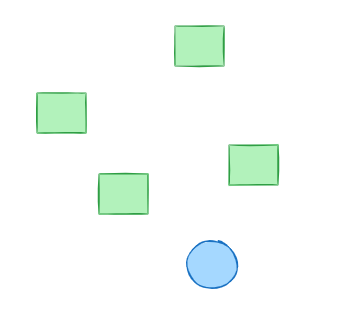

# :house_with_garden: Automatas Celulares
Juan David Meza Criollo  
Andres Avilán  

## 1. Reglas básicas de comportamiento

En la vida cotidiana, así como en los **autómatas celulares (AC)**, existen **reglas locales** que guían el comportamiento de cada individuo en función de su contexto inmediato o “vecindad”. Estas reglas no son impuestas por un control central, sino que emergen de la interacción con los demás y con el entorno, generando patrones de conducta colectivos.  

### En la casa
Algunas de las reglas cotidianas son:  
- Tender la cama antes de salir.  
- Servir la comida a los perros a las 8 a.m.  
- Cenar junto a mi hermano en las noches.  
- No hacer mucho ruido en las noches entre semana.  
- Recoger la losa sucia del cuarto.  

**Paralelismo con AC:** cada regla depende de un **estado inicial** (por ejemplo: “antes de salir” → tender la cama) o de la **influencia de un vecino** (cenar junto a mi hermano). En términos de vecindad, estas conductas se activan de acuerdo con la situación del entorno inmediato, igual que una celda que cambia de estado dependiendo de sus vecinas.

---

### En la universidad
Algunas reglas sociales y académicas son:  
- Prestar atención en clase.  
- No hacer plagio.  
- Taparse al estornudar.  

**Paralelismo con AC:** estas normas funcionan como **condiciones de transición**:  
- Si el profesor explica (vecino activo), el estudiante atiende.  
- Si un compañero estornuda, la reacción esperada es cubrirse.  
Así como en los AC, el comportamiento individual se ajusta en relación con la **vecindad académica y social**.

---

### En el transporte público
Las reglas más comunes son:  
- Hacer la fila mientras se espera el bus.  
- Respetar el turno al abordar.  

**Paralelismo con AC:** aquí se observa claramente la lógica de **vecindad secuencial**: una persona avanza solo cuando la persona de adelante avanza, igual que una celda cambia su estado en función de lo que ocurre en su vecina inmediata.

---

### Síntesis
Al igual que en los autómatas celulares, las conductas en casa, en la universidad o en el transporte público se rigen por **reglas simples y locales** que, al combinarse, generan un **orden social colectivo**.

## 🚗 2. Modelo de difusión o robot de dos ruedas

En lugar de un modelo de difusión, se plantea un **robot móvil de dos ruedas** que se desplaza en un entorno y debe **evitar obstáculos**. Para modelar su comportamiento podemos usar el marco de los **autómatas celulares (AC)**.

### Estados del robot
- `0` → Avanzar recto.  
- `1` → Girar a la izquierda.  
- `2` → Girar a la derecha.  
- `3` → Detenerse.  

### Vecindad
El robot percibe su entorno inmediato mediante sensores de proximidad. En el modelo, los obstáculos cercanos equivalen a los **vecinos activos** en un AC, que determinan el cambio de estado.

- **Sensor izquierdo** → detecta obstáculos a la izquierda.  
- **Sensor derecho** → detecta obstáculos a la derecha.  
- **Sensor frontal** → detecta obstáculos de frente.  

### Reglas de transición (analogía con AC)
1. Si **sensor frontal detecta obstáculo** → cambiar a estado `3` (detenerse) y luego decidir giro.  
2. Si **sensor izquierdo detecta obstáculo** → pasar a estado `2` (girar a la derecha).  
3. Si **sensor derecho detecta obstáculo** → pasar a estado `1` (girar a la izquierda).  
4. Si **ningún sensor detecta obstáculo** → permanecer en estado `0` (avanzar recto).  

### Paralelismo con los autómatas celulares
- En un AC, cada celda actualiza su estado en función de la vecindad (ej. Moore o Von Neumann).  
- En el robot, el "estado" es la acción que ejecuta, y la "vecindad" son los sensores que leen el entorno inmediato.  
- Así como en un AC los patrones globales emergen de reglas locales, en el robot el **comportamiento global de navegación** emerge de reglas simples de evasión.  

### Ejemplo de secuencia
1. El robot inicia en estado `0` (avanzando).  
2. Encuentra un obstáculo de frente → pasa a estado `3` (detenerse).  
3. Evalúa los sensores laterales: si el derecho está libre, pasa a estado `2` (giro derecha).  
4. Una vez libre, regresa al estado `0` (avanzar).  

De esta forma, con reglas **locales y simples**, el robot logra un comportamiento **emergente de navegación autónoma**, análogo a la dinámica de los autómatas celulares.

## 3. Simulación de un robot y coliciones. 

Primero se planteo el esquematico: 

<p align="center">
  
</p>

```python
import matplotlib.pyplot as plt
import matplotlib.animation as animation
import numpy as np

# -----------------------------
# 1. Parámetros del entorno
# -----------------------------
arena_size = 10
num_obstacles = 4
step_size = 0.2  # cuanto avanza por paso

# Obstáculos aleatorios
np.random.seed(40)  
obstacles = np.random.uniform(1, 10, size=(num_obstacles, 2))

# -----------------------------
# 2. Robot inicial
# -----------------------------
robot_pos = np.array([5.0, 2.0])  # posición inicial
directions = {
    "up": np.array([0, 1]),
    "down": np.array([0, -1]),
    "left": np.array([-1, 0]),
    "right": np.array([1, 0]),
}
robot_dir = "up"  # dirección inicial

# -----------------------------
# 3. Función para detección de colisión
# -----------------------------
def detect_collision(pos, direction, obstacles, threshold=0.6):
    """Detecta si en la próxima posición hay un obstáculo o un borde"""
    next_pos = pos + directions[direction] * step_size
    
    # 1) Revisar obstáculos
    for obs in obstacles:
        if np.linalg.norm(next_pos - obs) < threshold:
            return True
    
    # 2) Revisar bordes de la cuadrícula
    if (next_pos[0] - threshold < 0 or next_pos[0] + threshold > arena_size or
        next_pos[1] - threshold < 0 or next_pos[1] + threshold > arena_size):
        return True
    
    return False

# -----------------------------
# 4. Reglas de comportamiento
# -----------------------------
def update_robot(pos, direction, obstacles):
    if detect_collision(pos, direction, obstacles):
        # Si hay choque, giramos a otra dirección
        if direction == "up":
            direction = "right"
        elif direction == "right":
            direction = "down"
        elif direction == "down":
            direction = "left"
        else:
            direction = "up"
    # Avanzar en la dirección actual
    pos = pos + directions[direction] * step_size
    return pos, direction

# -----------------------------
# 5. Animación con matplotlib
# -----------------------------
fig, ax = plt.subplots(figsize=(6, 6))
ax.set_xlim(0, arena_size)
ax.set_ylim(0, arena_size)
ax.set_aspect('equal')

# Dibujar obstáculos
obstacle_patches = [plt.Rectangle((x-0.3, y-0.3), 0.6, 0.6, color="green") for x, y in obstacles]
for patch in obstacle_patches:
    ax.add_patch(patch)

# Dibujar robot
robot_patch = plt.Circle(robot_pos, 0.3, color="skyblue", ec="blue")
ax.add_patch(robot_patch)

def animate(frame):
    global robot_pos, robot_dir
    robot_pos, robot_dir = update_robot(robot_pos, robot_dir, obstacles)
    robot_patch.center = robot_pos
    return robot_patch,

ani = animation.FuncAnimation(fig, animate, frames=200, interval=200, blit=True)
plt.show()

```

<p align="center">
  
</p>


